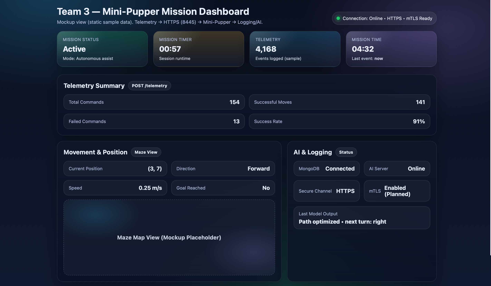
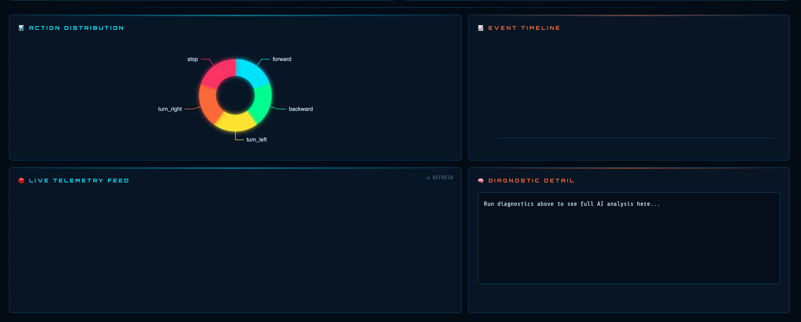

# 🐾 Team 3 – Mini-Pupper Mission Dashboard

## Overview

This folder contains the live mission dashboard for the Team 3 Mini-Pupper system.

The dashboard provides real-time visualization of:

- Mission status
- Telemetry data
- Robot movement information
- AI and logging system health

---

## How to Run

### Step 1 — Open SSH Tunnel to Logging Server

```bash
ssh -L 27017:localhost:27017 amp7777@10.170.8.130
```

Keep this terminal open the entire time.

### Step 2 — Start the Dashboard Backend

```bash
cd dashboard
python3 main.py
```

### Step 3 — Open the Dashboard

Open `index.html` in your browser:

```bash
open /path/to/abcapsp26TuThT3/dashboard/index.html
```

### Requirements

```bash
pip3 install fastapi uvicorn pymongo python-dotenv requests websockets
```

---

## System Architecture Context

Telemetry flow in our system:

```
GameHat Maze App
↓ HTTPS (Port 8445)
Mini-Pupper Telemetry Receiver
↓
Logging Server (MongoDB) — 10.170.8.130
↓
main.py (reads MongoDB via SSH tunnel, pushes via WebSocket)
↓
Dashboard (index.html)
↓
AI Server — 10.170.8.109
```

---

## Dashboard Sections

### 1. Status Overview

- Mission Status
- Mission Timer (Session Runtime)
- Total Telemetry Events
- Last Event Timestamp
- Secure Connection Indicator (HTTPS / mTLS)

### 2. Telemetry Summary

- Total Commands
- Successful Moves
- Failed Commands
- Success Rate

### 3. Movement & Position

- Current (X, Y) Maze Coordinates
- Direction
- Goal Reached Indicator
- Live Maze Map Visualization

### 4. AI & Logging

- MongoDB Status
- AI Server Status
- Secure Channel Status (HTTPS)
- mTLS Status
- WebSocket Status
- Robot Bridge Status
- Last Model Output

### 5. Charts

- Action Distribution (pie chart)
- Event Timeline (bar chart)
- Live Telemetry Feed

---

## Security Representation

The dashboard reflects the system's secure telemetry design:

- HTTPS is used for telemetry transmission
- mTLS support is enforced on port 8445
- MongoDB is accessed via SSH tunnel only — never exposed publicly
- Secure connection status is displayed in the UI

---

## Current Status

This is a live integrated dashboard.

- ✅ Live MongoDB connection via SSH tunnel
- ✅ Real-time telemetry feed via WebSocket
- ✅ Live maze map from player position data
- ✅ AI diagnostics endpoint (local fallback if AI server offline)

---

## Team 3 – CMPSC Project

Mini-Pupper + Maze App + Telemetry + AI Integration

---
## Current Status



