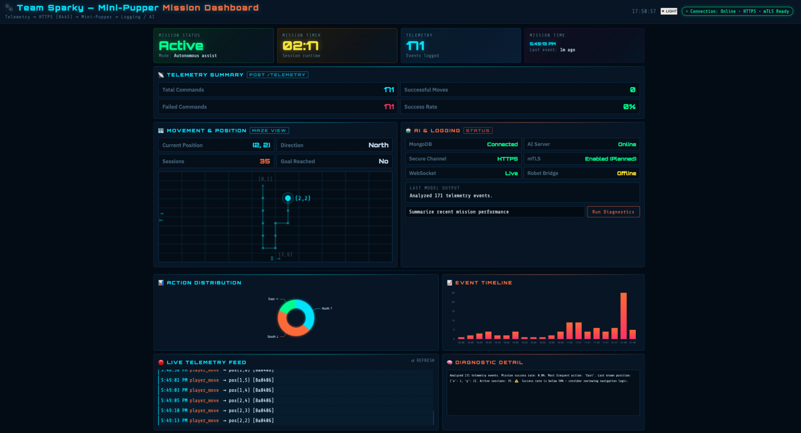
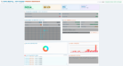

# 🐾 Team Sparky – Mini-Pupper Mission Dashboard

## Overview

This folder contains the live mission dashboard for the Team Sparky Mini-Pupper system.

The dashboard provides real-time visualization of:

- Mission status and session timer
- Telemetry data from MongoDB
- Robot movement and maze path visualization
- AI diagnostics and logging system health

---

## How to Run

### Step 1 — Create a virtual environment (first time only)

```bash
cd dashboard
python3 -m venv venv
source venv/bin/activate
pip install fastapi uvicorn pymongo python-dotenv requests websockets redis
```

### Step 2 — Open SSH tunnels to logging server

You need three tunnels: MongoDB, Redis, and the HTTPS telemetry receiver. Open each in its own terminal and keep them all running:

```bash
# MongoDB
ssh -L 27017:localhost:27017 USERID@10.170.8.130

# Redis (in a separate terminal)
ssh -L 6379:localhost:6379 USERID@10.170.8.130

# HTTPS telemetry receiver (in a separate terminal)
ssh -L 8445:localhost:8445 USERID@10.170.8.130
```

The 8445 tunnel is required when the receiver's TLS certificate has `CN=localhost` only — connecting directly to the server's IP would fail mTLS hostname verification. Tunneling lets your local maze client talk to `https://localhost:8445/...`, which matches the cert.

**Skip the 8445 tunnel if a receiver with an IP-SAN cert is already running.** From the repo root, run:

```bash
curl -s --cacert https_final/certs/ca.crt --cert https_final/certs/client.crt --key https_final/certs/client.key https://10.170.8.130:8445/health
```

If you get `{"ok":true}`, you're good — no tunnel needed. If you get a `subjectAltName does not match` error or a connection refused, set up the 8445 tunnel as shown above.

### Step 3 — Start the dashboard backend

In another terminal:

```bash
cd dashboard
source venv/bin/activate
MONGO_URI="mongodb://localhost:27017" MONGO_DB="maze" MONGO_COL="team3ttmoves" python3 main.py
```

You should see:

```
[db] Connected to MongoDB: mongodb://localhost:27017  db=maze  col=team3ttmoves
[redis] Connected to Redis: localhost:6379
[server] Dashboard API running at http://localhost:8000
[poller] Starting MongoDB poll loop (2s interval)
```

> **Note on collection name:** the HTTPS receiver (`https_final/maze_https_final`) writes telemetry to the `team3ttmoves` collection by default. If you point the dashboard at the older `moves` collection you will see no live data.

### Step 4 — Serve the dashboard UI

`main.py` is API-only and does not serve `index.html`. In yet another terminal:

```bash
cd dashboard
python3 -m http.server 8080
```

Then open <http://localhost:8080/index.html> in your browser. The page talks to the backend on `localhost:8000` for data and to `localhost:8000/ws` for live updates.

---

## Environment Variables

| Variable | Default | Description |
|---|---|---|
| `MONGO_URI` | `mongodb://localhost:27017` | MongoDB connection string |
| `MONGO_DB` | `maze` | MongoDB database name |
| `MONGO_COL` | `moves` | MongoDB collection name (`team3ttmoves` for live data) |
| `DASHBOARD_PORT` | `8000` | Port the FastAPI backend listens on |
| `AI_SERVER_URL` | _(empty)_ | Optional AI server URL; falls back to local diagnostics if unset |
| `REDIS_HOST` | `localhost` | Redis host |
| `REDIS_PORT` | `6379` | Redis port |
| `REDIS_KEY_PREFIX` | `team3ttmission` | Redis key prefix for mission summary hashes |

---

## API Endpoints

| Method | Path | Description |
|---|---|---|
| `GET` | `/health` | MongoDB + server status check |
| `GET` | `/moves` | Recent telemetry events (`?limit=100&sort=desc&session_id=...`) |
| `GET` | `/stats` | Aggregate stats computed from up to 5000 recent events |
| `GET` | `/sessions` | List distinct session IDs |
| `GET` | `/mission_stats` | Per-mission move counts from Redis |
| `GET` | `/ai/diagnostics` | AI analysis (`?query=...`); proxies to `AI_SERVER_URL` or runs locally |
| `WS` | `/ws` | WebSocket — receives `init`, `update`, and `heartbeat` messages |

---

## System Architecture Context

Telemetry flow in our system:

```
GameHat Maze App
↓ HTTPS (Port 8445)
Mini-Pupper Telemetry Receiver
↓
Logging Server (MongoDB + Redis) — 10.170.8.130
↓
main.py (reads MongoDB via SSH tunnel, pushes via WebSocket)
↓
Dashboard (index.html)
↓
AI Server — 10.170.8.109
```

Redis stores per-session mission summaries (move counts by direction) under keys matching `{REDIS_KEY_PREFIX}:{session_id}`. The `/mission_stats` endpoint aggregates these for the Action Distribution chart.

---

## Dashboard Sections

### 1. Mission Status Cards

- **Mission Status** — Active / Complete / Standby; updates automatically when telemetry arrives or goal is reached
- **Mission Timer** — Counts up from when the current session started; resets on new session ID
- **Telemetry Events** — Total events logged to MongoDB
- **Mission Time** — Timestamp and age of the most recent telemetry event

### 2. Telemetry Summary

- Total Commands
- Successful Moves (goal_reached events)
- Failed Commands
- Success Rate

### 3. Movement & Position

- Current (X, Y) maze coordinates
- Last direction of movement (North / South / East / West / Stationary)
- Active sessions count
- Goal Reached indicator
- Live maze map — draws the robot's path trail from the last 120 positions; gaps appear at non-adjacent teleport jumps

### 4. AI & Logging

- MongoDB, WebSocket, Robot Bridge, Secure Channel, and mTLS status chips
- **Last Model Output** — first sentence of the most recent AI diagnostic result
- **Run Diagnostics** — sends a custom query to `/ai/diagnostics` and shows the full response in the Diagnostic Detail panel

### 5. Charts

- **Action Distribution** — donut chart of directional moves (North/South/East/West) for the current session
- **Event Timeline** — bar chart of events per minute (last 20 buckets)

### 6. Live Telemetry Feed

Scrolling log of the 200 most recent events with timestamp, action type, position, and session ID.

---

## UI Features

- **Light/Dark theme toggle** — persisted in `localStorage`; click ☀ LIGHT / ☾ DARK in the header
- **WebSocket auto-reconnect** — exponential backoff up to 15 seconds
- **Session detection** — when a new `session_id` appears in the feed, the timer resets and maze path clears automatically

---

## Security Representation

The dashboard reflects the system's secure telemetry design:

- HTTPS is used for telemetry transmission
- mTLS support is enforced on port 8445
- MongoDB is accessed via SSH tunnel only — never exposed publicly
- Secure connection status is displayed in the UI

---

## Current Status

- ✅ Live MongoDB connection via SSH tunnel
- ✅ Real-time telemetry feed via WebSocket
- ✅ Live maze map from player position data
- ✅ Per-session action distribution from Redis
- ✅ AI diagnostics endpoint (local fallback if AI server offline)
- ✅ Light/Dark theme toggle

---

## Screenshots




---

## Team Sparky – CMPSC Project

Mini-Pupper + Maze App + Telemetry + AI Integration
