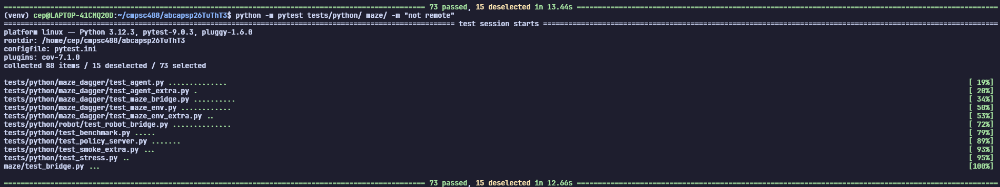
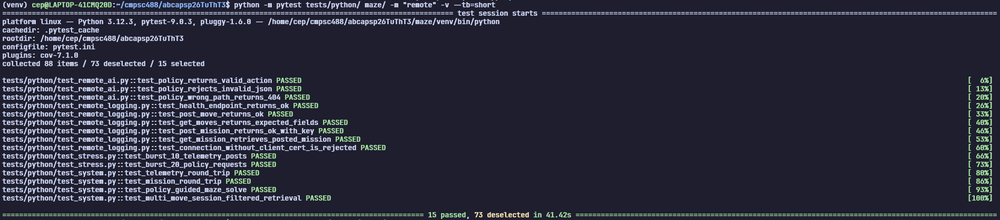
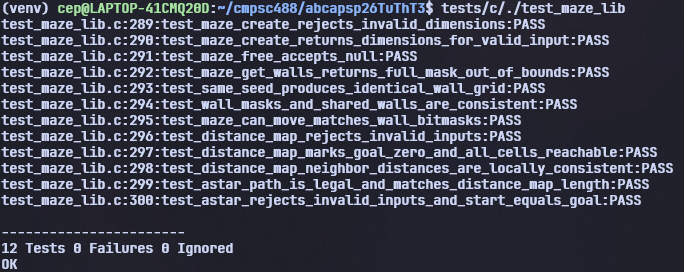

# Testing

## Setup
First, follow the usual steps to set up the logging and AI servers (only needed for running remote tests):

1. Ubuntu/Unix terminal #1:
	1. `ssh -L 27017:127.0.0.1:27017 cep5603@10.170.8.130` (replace my username)
	2. `ssh -L 6379:127.0.0.1:6379 cep5603@10.170.8.109` (replace my username)
2. Ubuntu/Unix terminal #2:
	1. SSH into the logging server
	2. Navigate to the `https_final` directory (`cd /home/team3tt/abcapsp26TuThT3/https_final`)
	3. `MONGO_COL="team3ttmoves" MONGO_URI="mongodb://localhost:27017" ./maze_https_final`
3. Ubuntu/Unix terminal #3:
	1. SSH into the AI server
	2. Navigate to the `maze` directory (must be done in your own user directory: `cd /home/cep5603/abcapsp26TuThT3/maze`)
    3. `source venv/bin/activate`
	4. `python3 policy_server.py`

## Running Tests
From the local client:

### Pytest (local) tests
```bash
python -m pytest tests/python/ maze/ -m "not remote" --tb=short
```



### Pytest (remote) tests
```bash
python -m pytest tests/python/ maze/ -m "remote" --tb=short
```



### Unity (local) tests
```bash
tests/c/./test_maze_lib
```


